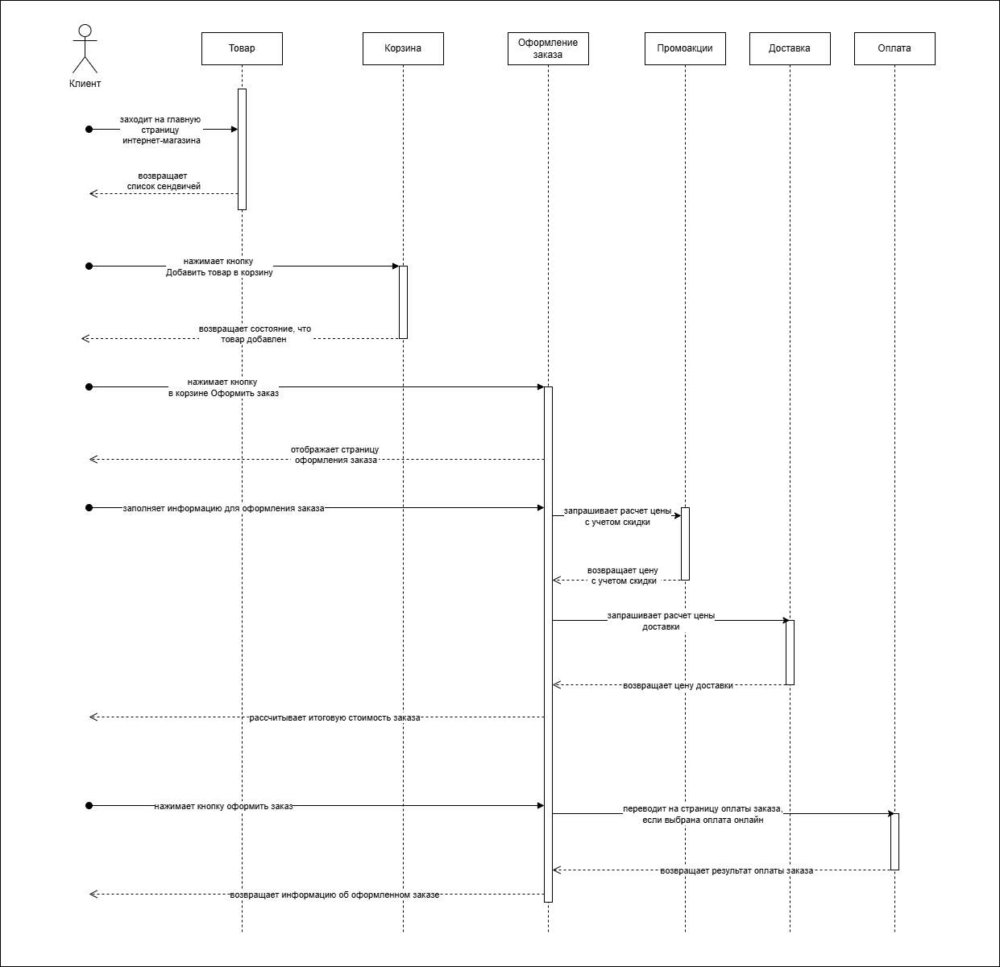

## Ката: у меня будет BLT

### Описание

Национальный магазин сэндвичей хочет включить функцию отправки по факсу в вашем заказе, но вместо этого через Интернет (в дополнение к их текущей услуге отправки по факсу)

### Количество пользователей: 
Тысячи, а в один прекрасный день, возможно, и миллионы

### Требования:
1. пользователи оформят заказ, затем им будет указано время, чтобы забрать свой сэндвич, и схема проезда в магазин (которая должна быть интегрирована с несколькими внешними картографическими сервисами, включающими информацию о дорожном движении)
2. если магазин предлагает услугу доставки, отправьте водителя с сэндвичем пользователю
3. доступность для мобильных устройств
4. предлагайте ежедневные национальные промо-акции/специальные предложения
5. предлагайте ежедневные местные промо-акции / специальные предложения
6. принимайте оплату онлайн или лично / при доставке

### Дополнительная информация:
1. Магазины сэндвичей работают по франшизе, у каждого из них свой владелец.
2. Материнская компания планирует в ближайшем будущем расширить свою деятельность за рубежом.
3. Корпоративная цель - нанять недорогую рабочую силу для получения максимальной прибыли.

### Пользовательские сценарии
1. Есть авторизованный клиент   
   И есть интернет-магазин "BLT"  
   И клиент заходит на главную страницу интернет-магазина   
   Тогда клиент видит карточки сендвичей со следуюшими параметрами:  
    - название сендвича
    - цена сендвича
    - изображение сендвича
    - вес сендвича
2. Есть авторизованный клиент  
   И есть интернет-магазин "BLT"  
   И открыта главная страница магазина с карточками товаров  
   Тогда клиент нажимает на кнопку Добавить в корзину для понравившихся товаров  
   И появляется значок корзины с отображаемой суммой заказа   
3. Есть авторизованный клиент  
   И есть интернет-магазин "BLT"   
   И открыта главная страница магазина с карточками товаров  
   И клиент нажимает на значок корзины  
   Тогда открывается страница оформления заказа со следующими разделами:  
    - информация о клиенте: имя, телефон, email
    - адрес доставки: город, улица дом, квартира, подъезд, номер домофона
    - район доставки: самовывоз, центр, окраина
    - комментарий
    - промокод
    - способ оплаты: онлайн через СБП, лично оплата картой, лично оплата наличными
    - сумма заказа
5. Есть авторизованный клиент  
   И есть интернет-магазин "BLT"   
   И открыта страница оформления заказа   
   И клиент ввел все данные для оформления заказа  
   Тогда клиент нажал на кнопку Оформить заказ  
6. Есть авторизованный клиент  
   И есть интернет-магазин "BLT"   
   И открыта страница оформления заказа  
   И клиент нажал на кнопку Оформить заказ  
   Тогда клиент увидел страницу, что заказ успешно оформлен со следующей информацией:  
    - номер заказа
    - время доставки заказа
    - заказ успешно оплачен
    - информацию о курьере, если клиент оформил район доставки: центр или окраина
    - информацию о магазине, если клиент оформил район доставки: самовывоз
7. Есть авторизованный клиент  
   И есть интернет-магазин "BLT"   
   И открыта страница оформления заказа со следующими разделами  
   И клиент выбрал район доставки = самовывоз  
   Тогда клиент увидел карту с точками магазинов, откуда можно забрать заказ  
8. Есть авторизованный клиент  
   И есть интернет-магазин "BLT"   
   И открыта страница оформления заказа со следующими разделами  
   И клиент выбрал район доставки = самовывоз  
   И клиент выбрал магазин на карте, откуда будет забирать заказ  
   Тогда система рассчитала и показала интервалы времени, когда заказ можно будет забрать   
8. Есть авторизованный клиент  
   И есть интернет-магазин "BLT"   
   И открыта страница оформления заказа со следующими разделами  
   И клиент выбрал район доставки = самовывоз  
   И клиент выбрал магазин на карте, откуда будет забирать заказ  
   И клиент выбрал интервал времени, когда заберет заказ  
   Тогда система пересчитала стоимость заказа   
9. Есть авторизованный клиент  
   И есть интернет-магазин "BLT"   
   И открыта страница оформления заказа со следующими разделами  
   И клиент выбрал район доставки = самовывоз  
   Тогда клиент увидел карту с точками магазинов, откуда можно забрать заказ  
10. Есть авторизованный клиент  
    И есть интернет-магазин "BLT"  
    И открыта страница оформления заказа со следующими разделами  
    И клиент выбрал район доставки = центр или окраина  
    И клиент выбрал точку на карте, куда нужно будет доставить заказ  
    Тогда система рассчитала и показала интервалы времени, когда заказ может быть доставлен
11. Есть авторизованный клиент  
    И есть интернет-магазин "BLT"  
    И открыта страница оформления заказа со следующими разделами  
    И клиент выбрал район доставки = центр или окраина  
    И клиент указал точку на карте, куда нужно будет доставить заказ  
    И клиент выбрал интервал времени, когда заказ должен быть доставлен  
    Тогда система пересчитала стоимость заказа  
12. Есть авторизованный клиент  
    И есть интернет-магазин "BLT"  
    И клиент заходит на страницу местных и национальных промоакций  
    Тогда клиент видит список промоакций  
    И может скопировать промокод, чтобы ввести его на странице оформления заказа  

### Назначение сервисов и их зона ответственности
#### Сервис Товар
1. Назначение: предназначен для хранения информации о сендвичах
2. Зона ответственности: отвечает за предоставление информации о сендвичах и их параметрах

#### Сервис Корзина
1. Назначение: предназначен для расчета стоимости заказа из выбранных товаров
2. Зона ответственности: отвечает за отображение добавленных товаров в корзину и расчет стоимости заказа

#### Сервис Оформление заказа
1. Назначение: предназначен для оформления заказа клиента
2. Зона ответственности: отвечает за сбор информации со всех сервисов и высчитывает итоговую цену заказа

#### Сервис Доставка 
1. Назначение: предназначен для хранения информации о различных способах доставки
2. Зона ответственности: отвечает за предоставление информации о способах доставки и рассчитывает стоимость доставки

#### Сервис Оплата
1. Назначение: предназначен для хранения информации о способах оплаты
2. Зона ответственности: отвечает за предоставление информации о способах оплаты и выполняет интеграции со сторонними сервисами списания средств клиента

#### Сервис Промоакции
1. Назначение: предназначен для хранения информации о местных и национальных промоакциях
2. Зона ответственности: отвечает за предоставление информации о промоакциях и высчитывает цену заказа с учетом скидки

### Схема взаимодействия сервисов

### Контракты взаимодействия сервисов
#### Сервис Товар
1. GET /products - получение информации о сендвичах

#### Сервис Корзина
1. POST /cart/product/{id} - добавляет товар в корзину, возвращает стоимость заказа
2. DELETE /cart/product/{id} - удаляет товар из корзины, возвращает стоимость заказа

#### Сервис Оформление заказа
1. POST /order - создает заказ
2. PUT /order - изменяет заказ, вводя информацию о параметрах заказа

#### Сервис Доставка 
1. POST /cost - рассчитывает цену доставки по способу доставки

#### Сервис Промоакции
1. POST /cost - рассчитывает цену с учетом скидки

#### Сервис Оплата
1. POST /payment - выполняет онлайн оплату заказа

