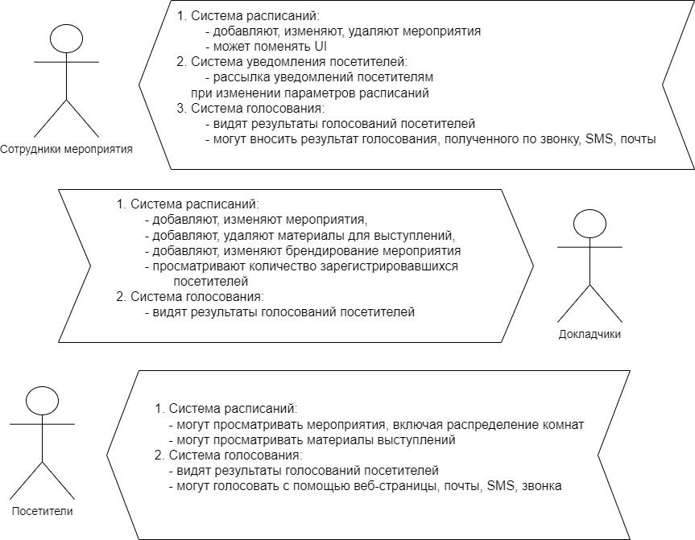

## Ката: Все в порядке, без сучка и задоринки

### Описание:

Организатору конференции нужна система управления конференцией, которая используется как докладчиками, так и посетителями

### Пользователи:
1. сотни докладчиков
2. десятки сотрудников мероприятия, 
3. тысячи посетителей

### Требования:

1. посетители могут получить доступ к расписанию выступлений онлайн, включая распределение комнат
2. посетители могут голосовать "за" или "против"
3. слайды независимых докладчиков доступны онлайн только посетителям
4. система оценки докладов с помощью веб-страницы, электронной почты, SMS или телефона для посетителей конференции
5. спикеры могут управлять выступлениями (вводить, редактировать, модифицировать)
6. каждая конференция (с другой тематикой) может быть брендирована спикерами
7. организатор выступлений может уведомлять участников об изменениях расписания с точностью до минуты (если посетители зарегистрируются)

### Дополнительный контекст:
1. Конференция проходит по всей территории США.
2. Очень небольшой штат поддержки.
3. "Взрывной" трафик: чрезвычайно загруженный во время проведения конференции.
4. Организатор конференции хочет легко поменять UI сайта для различных технологических предложений.

### Кейс:

### 