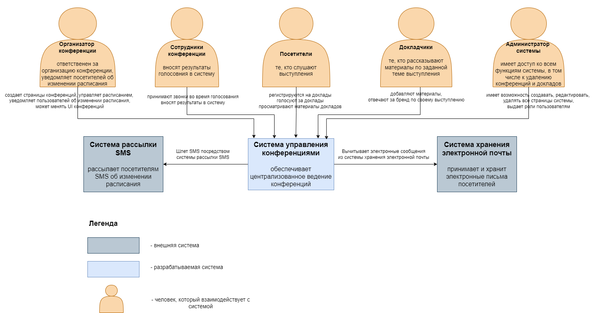
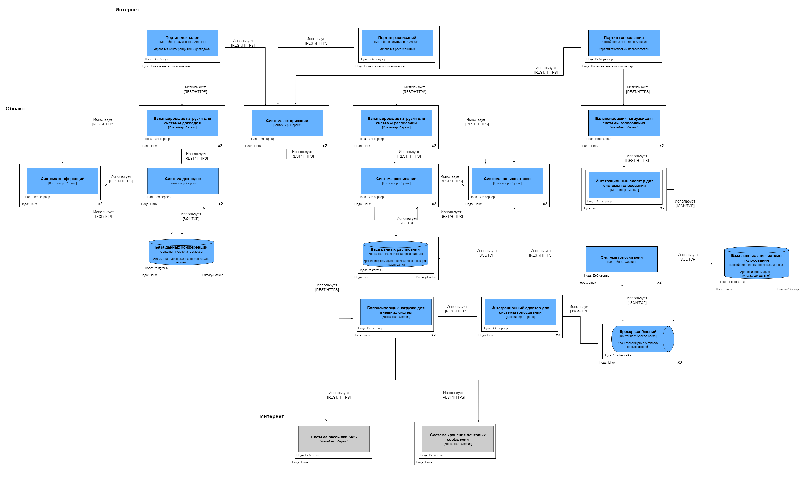
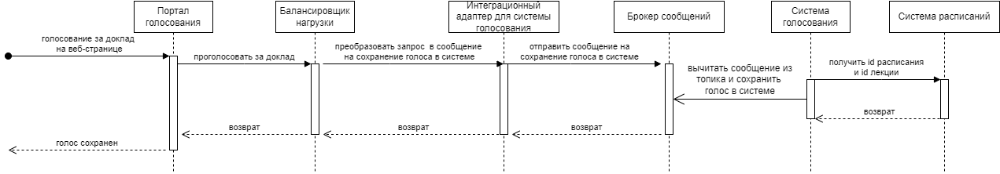
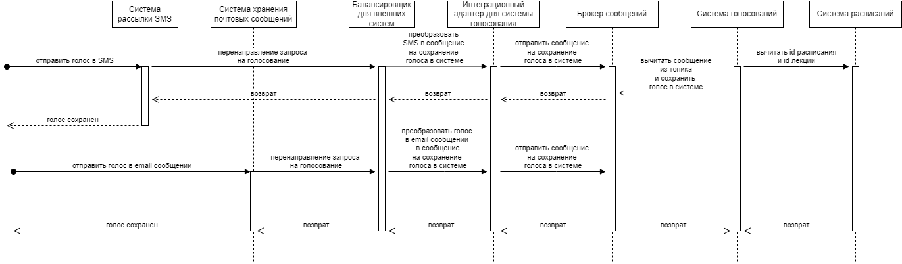
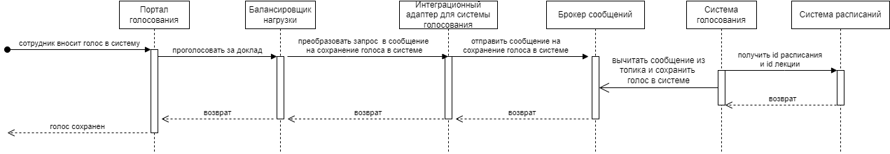
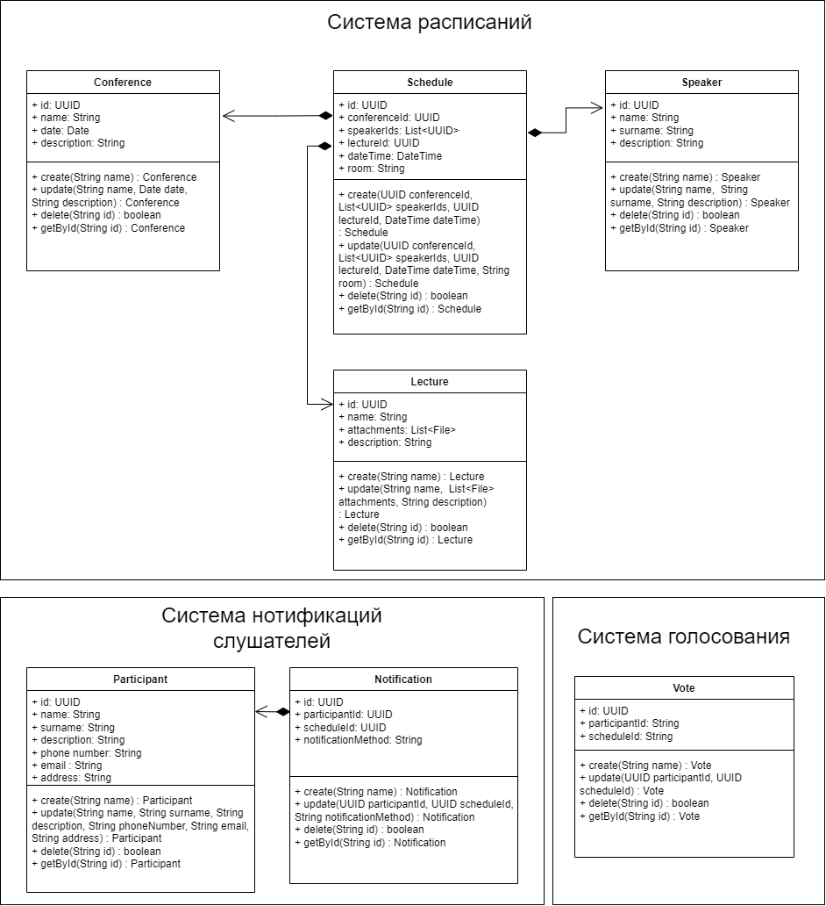
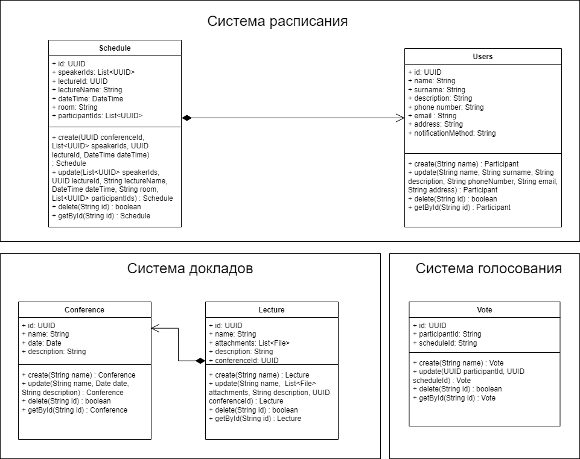

# Проектная работа 
# "Система управления конференциями"

## Описание проблемы
Организатору конференции нужна система управления конференцией, которая используется как докладчиками, так и посетителями.

### Контекст:

#### Ключевые участники
1. Миллионы посетителей  
   Слушают доклады, голосуют за и против, имеют доступ к материалам
2. Десятки сотрудников мероприятия  
   Составляют расписание конференции, просматривают и вносят результаты голосований
3. Сотни докладчиков  
   Изменяют мероприятия и материалы выступлений, добавляет брендирования для выступлений, видят результаты голосований
4. Организатор выступлений   
   Уведомляет зарегистрированных посетителей об изменениях времени проведения докладов с точностью до минуты.
   Имеет возможность легко поменять UI сайта для различных технологических предложений.
5. Администратор    
   Имеет доступ ко всем функциям системы, в том числе регистрирует сотрудников и организатора выступлений в системе.

#### Требования:

1. Посетители могут получить доступ к расписанию выступлений онлайн, включая распределение комнат
2. Посетители могут голосовать "за" или "против"
3. Слайды независимых докладчиков доступны онлайн только посетителям
4. Система оценки докладов с помощью веб-страницы, электронной почты, SMS или телефона для посетителей конференции
5. Спикеры могут управлять выступлениями (вводить, редактировать, модифицировать)
6. Каждая конференция (с другой тематикой) может быть брендирована спикерами
7. Организатор выступлений может уведомлять участников об изменениях расписания с точностью до минуты (если посетители зарегистрируются)

### Бизнес цель
Разработать новую систему управлений конференциями, которая позволит обеспечить беспроблемное проведение
конференций, выдержит высокую нагрузку во время голосования, и обеспечит приток новых докладчиков и посетителей.

### Архитектурные драйверы
Отсутствие системы управления мероприятиями, что влечет за собой:
1. повышенную нагрузку по организации мероприятий на небольшой штат поддержки, которая не справляется
   во время голосований и теряет часть голосов посетителей. Соотвественно, что приводит к неверным
   результатам голосований и все меньше докладчиков соглашаются принимать участие в конференциях;
2. потерю посетителей в случае переноса мероприятий, поскольку отсутствует система уведомлений
   посетителей;
3. у докладчиков нет единой системы по размещению своих материалов для выступлений,
   что может привести к срыву выступления, если докладчик забыл принести презентацию или потерял флешку.

### Ограничения технологические и бизнесовые
1. Конференция проходит по всей территории США.
2. Очень небольшой штат поддержки.
3. "Взрывной" трафик: чрезвычайно загруженный во время проведения конференции.
4. Организатор конференции хочет легко поменять UI сайта для различных технологических предложений. 

## Описание требований

### Пользовательские сценарии
#### 1. UC-1 Регистрация посетителей в системе 
Пользователи регистрируются в системе управлений конференциями, то есть создают аккаунт в системе со своим логином и паролем.
#### 2. UC-2 Регистрация сотрудников мероприятия и организатора выступлений администратором системы.
Администратор имеет возможность регистрировать сотрудников мероприятия и организатора выступлений и назначать им соотвествуюшие роли.
#### 3. UC-3 Аутентификация и авторизация пользователей системы.
Пользователи могут логиниться в систему со своими логинами и паролями, после чего они получают доступ к системе в соответствии со своими ролями.
#### 4. UC-4 Создание/редактирование страницы конференции
Организатор имеет возможность создать страницу конференции и брендировать ее по своему усмотрению, может поменять стили 
и изображения для своих страниц конференций.
#### 5. UC-5 Создание докладов для выбранной конференции
Организатор может создавать доклады для созданной им конференции, указывая название выступления, время проведения доклада,
ссылку на комнату, где будет проводится выступление онлайн, имена спикеров.
#### 6. UC-6 Редактирование докладов спикерами
Спикеры могут добавлять материалы и брендированные логотипы, картинки для их выступлений.
#### 7. UC-7 Просмотр расписания конференции
Все зарегистрированные в системе пользователи могут просматривать расписание конференций, включая название докладов,
время и комнату их проведения, имена спикеров.
#### 8. UC-8 Просмотр докладов
Все зарегистрированные в системе пользователи могут просматривать страницы докладов, включая название и описание доклада,
время и комнату его проведения, материалов выступления, имена спикеров.
#### 9. UC-9 Нотификация посетителей об изменении расписания
Организатор конференции может уведомлять посетителей конференции об изменении времени проведения докладов посредством
SMS или сообщений в почту.
#### 10. UC-10 Голосование посетителями за понравивщийся доклад посредством веб-страницы
Посетители могут проголосовать "за" или "против" за выбранный ими доклад, используя веб-страницу голосования,
на которой можно будет выбрать название конференции, название доклада и выставить лайк или дизлайк.
#### 11. UC-11 Голосование посетителями за понравивщийся доклад посредством SMS или сообщения в почте
Посетитель отправляет SMS или сообщение в почту, наша система переодически вычитывает данные из сторонних систем
и добавляет голос пользователя в систему для выбранного доклада
#### 12. UC-12 Голосование посетителями за понравивщийся доклад посредством звонка сотруднику мероприятия
Посетитель звонит по заданному телефонному номеру оператору поддержки, голосует за выбранный доклад, и сотрудник мероприятия
вносит необходимые данные в систему, в частности для целевого доклада вносит лайк или дизлайк.
#### 13. UC-13 Удаление докладов и конференций
Администратор имеет возможность удалять конференции и доклады.
#### 14. UC-14 Просмотр результатов голосования
Все зарегистрированные пользователи системы могут просматривать сводные результаты голосования по конференции.

### Сценарии для атрибутов качества
Сценарии использования системы управления конференциями:    
1. В перерывах между конференциями ожидается минимальная нагрузка на систему, в частности, в это время только сотрудники, спикеры, администратор системы
и организатор конференции могут работать с системой. 
2. Примерно за месяц до проведения конференции ожидается средняя нагрузка на систему, порядка 10 миллионов регистраций в день.
3. Во время проведения конференции прогнозируется пиковая нагрузка на систему, поскольку в этом время ожидается пару сотен миллионов пользователей в системе.

#### Атрибуты качества
##### 1. Производительность системы   
Система должна выдерживать высокую нагрузку во время проведения конференции, поскольку потенциально могут пользоваться системой порядка 
во время конференции 335 миллионов посетителей, проживающих в США, то есть при равномерной нагрузке порядка 9000 запросов в секунду во время голосования.
За месяц до проведения конференции в среднем ожидается 115 запросов в секунду на регистрацию в системе.
Во время между проведения конференции ожидается минимальная нагрузка на систему, порядка сотни человек в день.
##### 2. Доступность сервисов
Доля ошибочных ответов от сервиса не должна превышать 1% от общего количества ответов сервиса во время минимальной нагрузки на систему.
Доля ошибочных ответов от сервиса не должна превышать 5% от общего количества ответов сервиса во время средней и максимальной нагрузки на систему.
##### 3. Время ответа сервиса
Время ответов сервиса не должно превышать 5 секунд в 95% случаев, за исключением формирования результатов голосования.
##### 4. Надежность
Во время сбоя система должна подтянуть изменения, которые не были сохранены в системе.
##### 5. Масштабируемость системы
Во время минимальной нагрузки на систему в перерывах между проведением конференций достаточно двухподовой конфигурации сервисов.
Во время пиковой нагрузки на систему во время проведения конференций система должна автоматически скалировать поды сервисов в зависимости от загруженности
CPU и памяти.
##### 6. Отказоустойчивость системы
В случае отказа сервисов системы в перерывах между конференциями время на определение сбоя MTTD должно составлять не более 2 часов, 
время на исправление сбоя должно составлять не более 1 дня.   
В случае отказа сервисов во время проведении конференций время на определение сбоя MTTD должно составлять не более 15 минут, 
время на исправление сбоя должно составлять не более 4 часов.     
Доступность сервисов ожидается 98%.   
В случае сбоев базы данных время на определение сбоя MTTD должно составлять не более 15 минут, 
время на исправление сбоя должно составлять не более 8 часов.   
В случае сбоя брокера сообщений система должна переключиться на синхронное взаимодействие между сервисами, и в этом случае
время на определение сбоя MTTD должно составлять не более 5 минут, время на исправление сбоя должно составлять не более 10 минут.    
Доступность инфраструктурных сервисов ожидается 99.5%.
##### 7. Время разработки (time to market)
##### 8. Стоимость разработки (budget/cost)
   
## Описание решения
### Контекстная диаграмма

### Диаграмма контейнеров приложения на основе выбранной модели функциональной декомпозиции

### Диаграмма развертывания

## Диграммы последовательностей для пользовательских сценариев 
#### 1. UC-1 Регистрация посетителей в системе
Пользователи регистрируются в системе управлений конференциями, то есть создают аккаунт в системе со своим логином и паролем.

#### 2. UC-2 Регистрация сотрудников мероприятия и организатора выступлений администратором системы.
Администратор имеет возможность регистрировать сотрудников мероприятия и организатора выступлений и назначать им соотвествуюшие роли.

#### 3. UC-3 Аутентификация и авторизация пользователей системы.
Пользователи могут логиниться в систему со своими логинами и паролями, после чего они получают доступ к системе в соответствии со своими ролями.

#### 4. UC-4 Создание/редактирование страницы конференции
Организатор имеет возможность создать страницу конференции и брендировать ее по своему усмотрению, может поменять стили
и изображения для своих страниц конференций.

#### 5. UC-5 Создание докладов для выбранной конференции
Организатор может создавать доклады для созданной им конференции, указывая название выступления, время проведения доклада,
ссылку на комнату, где будет проводится выступление онлайн, имена спикеров.

#### 6. UC-6 Редактирование докладов спикерами
Спикеры могут добавлять материалы и брендированные логотипы, картинки для их выступлений.

#### 7. UC-7 Просмотр расписания конференции
Все зарегистрированные в системе пользователи могут просматривать расписание конференций, включая название докладов,
время и комнату их проведения, имена спикеров.

#### 8. UC-8 Просмотр докладов
Все зарегистрированные в системе пользователи могут просматривать страницы докладов, включая название и описание доклада,
время и комнату его проведения, материалов выступления, имена спикеров.

#### 9. UC-9 Нотификация посетителей об изменении расписания
Организатор конференции может уведомлять посетителей конференции об изменении времени проведения докладов посредством
SMS или сообщений в почту.

#### 10. UC-10 Голосование посетителями за понравивщийся доклад посредством веб-страницы
Посетители могут проголосовать "за" или "против" за выбранный ими доклад, используя веб-страницу голосования,
на которой можно будет выбрать название конференции, название доклада и выставить лайк или дизлайк.

#### 11. UC-11 Голосование посетителями за понравивщийся доклад посредством SMS или сообщения в почте
Посетитель отправляет SMS или сообщение в почту, наша система переодически вычитывает данные из сторонних систем
и добавляет голос пользователя в систему для выбранного доклада

#### 12. UC-12 Голосование посетителями за понравивщийся доклад посредством звонка сотруднику мероприятия
Посетитель звонит по заданному телефонному номеру оператору поддержки, голосует за выбранный доклад, и сотрудник мероприятия
вносит необходимые данные в систему, в частности для целевого доклада вносит лайк или дизлайк.

#### 13. UC-13 Удаление докладов и конференций
Администратор имеет возможность удалять конференции и доклады.

#### 14. UC-14 Просмотр результатов голосования
Все зарегистрированные пользователи системы могут просматривать сводные результаты голосования по конференции.

## Архитектурные логи
### Архитектурный лог 1
#### Контекст
Необходимо разработать с нуля надежную легко масштабируемую систему управления конференцией, которая используется 
как докладчиками, так и посетителями, позволяющую выдерживать высокую нагрузку на систему во время голосования.

#### Альтернативы
1. Провести анализ текущих систем управления конференциями на рынке, возможно, выбрать из них.
2. Создать простой сайт средствами управления содержимым сайта, например, Wordpress по созданию, редактированию расписания конференций, внедрить в том числе на нем систему голосования.
3. Разработать собственное решение, которое позволит покрыть все потребности клиента.

#### Оценка и сравнительный анализ
1. Сравнение текущих систем на рынке

| Название системы | Преимущества | Недостатки |
|--- | --- | --- |
|Open Conference Systems |Есть личный кабинет пользователя. Можно прикладывать материалы.|Несовременный и неинтуинтивный интерфейс. Нельзя загружать материалы.|
|Microsoft Conference Manager|Приятный интерфейс. Единая регистрация на все конференции. Личный кабинет пользователя. Можно прикладывать материалы. Удобная форма создания конференций. Есть документация.|Отсутствует фильтрации по датам. В конференцию можно пригласить лишь зарегистрированного пользователя. Логотип не видно на сайте (можно только скачать).|
|Gamejam|Приятный дизайн. Есть календарь конференций. Единая регистрация на все конференции. Личный кабинет пользователя. Можно прикладывать материалы. Удобная форма создания конференций. У конференций есть статус.|Публичность всех продуктов (докладов). Нельзя указать соавторов. |

Вывод: в ходе сранивнительного анализа было выявлено, что ни одна из существующих систем управления конференций не имеет возможности голосования за доклады, которая требуется для клиента.

2. Создание сайта на Wordpress не подходит, поскольку тонкие настройки масштабирования системы не доступны в этом случае. Помимо этого клиент против хранения материалов системы на сторонних серверах, требуются собственные сервера.

3. Создание собственной системы покроет все потребности бизнеса, выглядит наиболее подходящим решением, поскольку собственное решение обеспечит нужные заказчику надежность и масштабирование системы.

#### Решение
В качестве решения выбран 3 вариант.

### Архитектурный лог 2
#### Контекст
Необходимо разработать с нуля надежную легко масштабируемую систему управления конференцией, которая используется как докладчиками, так и посетителями, позволяющую выдерживать высокую нагрузку на систему во время голосования.

#### Альтернативы
1. Провести анализ текущих систем управления конференциями и систем голосования на рынке, возможно, выбрать из готовых систем. Использовать две системы одновременно. В принципе может подойти, поскольку конечные пользователи для каждой системы различны.
2. Выбрать готовую систему управления конференциями или систему голосования, недостоющую систему разработать собственными силами.
3. Разработать пользовательский интерфейс самостоятельно, готовые системы управления конференциями и голосования использовать как backend часть.

#### Оценка и сравнительный анализ
1. В ходе сравнительного анализа систем управления конференциями была выбрана система Gamejam, как наиболее подходящая.
   Анализ существующих систем голосования выявил, что подходящей системы на рынке нет, поэтому ее придется разрабатывать самостоятельно.
   Клиент требует единый пользовательский интерфейс, поэтому данный вариант не подходит.
2. Вторая опция также не подходит из-за отсутствия единого пользовательского интерфейса.
3. Система управления конференциями Gamejam имеет недостаток - отсутствие возможности указывать соавторов выступления, который можно будет покрыть дополнительным вызовом бекенда Gamejam системы и отрисовкой соавторов в собственном UI интерфейсе. Система голосования будет разрабатываться собственными силами, поскольку подходящего решения на рынке не представлено. Пользовательский интерфейс также будет разрабатываться с нуля, поэтому покроет все требования заказчика.

#### Решение
В качестве решения выбран 3 вариант.

### Архитектурный лог 3
#### Контекст
Определить функциональную декомпозицию сервисов на основе стоимости изменений для ключевых сценариев

#### Альтернатива 1
##### Предметная область и функциональная декомпозиция

##### Оценка стоимости изменений
###### Сценарий 1:

Создание/Обновление/Удаление конференций, лекций, материалов лекций

Стоимость = С(Система раcписаний)

###### Сценарий 2:
Регистрация слушателя на конференцию

Стоимость = С(Система нотификаций)

###### Сценарий 3:
Уведомление слушателя об изменении времени или места доклада

Стоимость = С(Система нотификаций)

###### Сценарий 4:
Голосование слушателя за понравившийся доклад

Стоимость = С(Система голосования)

###### Сценарий 5:
Слушатель получает доступ ко времени проведения доклада или к распределению комнат

Стоимость = С(Система нотификаций) + С(Система расписаний)

###### Сценарий 6:
Просмотр результатов голосований

Стоимость = С(Система голосований) + С(Система расписаний)

###### Сценарий 7:
Просмотр количества зарегистрировшихся слушателей

Стоимость = С(Система нотификаций) + С(Система расписаний)

#### Альтернатива 2
##### Предметная область и функциональная декомпозиция

##### Оценка стоимости изменений
###### Сценарий 1:
Создание/Обновление/Удаление конференций, лекций, материалов лекций

Стоимость = С(Система докладов)

###### Сценарий 2:
Регистрация слушателя на конференцию

Стоимость = С(Система расписания)

###### Сценарий 3:
Уведомление слушателя об изменении времени или места доклада

Стоимость = С(Система расписания)

###### Сценарий 4:
Голосование слушателя за понравившийся доклад

Стоимость = С(Система голосования)

###### Сценарий 5:
Слушатель получает доступ ко времени проведения доклада или к распределению комнат

Стоимость = С(Система расписаний)

###### Сценарий 6:
Просмотр результатов голосований

Стоимость = С(Система голосований) + С(Система расписаний)

###### Сценарий 7:
Просмотр количества зарегистрировшихся слушателей

Стоимость = С(Система расписаний)

#### Сравнительный анализ решений и вывод

|                |Сценарий 1|Сценарий 2|Сценарий 3|Сценарий 4|Сценарий 5|Сценарий 6|Сценарий 7|
|----------------|---|---|---|---|---|---|---|
| Альтернатива 1 | Система раcписаний |Система нотификаций|Система нотификаций|Система голосования| Система нотификаций; Система расписаний | Система голосований; Система расписаний | Система нотификаций; Система расписаний |
| Альтернатива 2 | Система докладов |Система расписания|Система расписания|Система голосования| Система расписаний | Система голосований; Система расписаний | Система расписаний |

Сравнительный анализ показал, что во втором решении для сценариев 5 и 7 требуется меньшая стоимость изменений, поэтому второй вариант решения наиболее предпочтителен.

### Архитектурный лог 4
#### Контекст
Необходимо выбрать базу данных, которая будет выдерживать пиковую нагрузку на систему во время проведения конференций.

#### Альтернативы
1. PostgreSQL DB
2. MySQL DB

#### Альтернатива 1
1. PostgreSQL поддерживает более широкий спектр современных типов данных, включая массивы, hstore (хранилище типа “ключ-значение”) и JSONB (бинарный JSON), 
которые обеспечивают более гибкие и эффективные возможности хранения данных.
2. PostgreSQL поддерживает геопространственные данные, включая богатый набор типов данных, функций и операторов для работы с географическими данными.
3. PostgreSQL имеет более совершенную систему индексирования, чем MySQL, включая поддержку индексов B-tree, GiST (Generalized Search Tree. Обобщенное поисковое дерево) и GIN (Generalized Inverted Index. Обобщенный обратный индекс).
Они предоставляют больше возможностей для оптимизации производительности запросов и поиска данных.
4. PostgreSQL поддерживает мульти-мастер (с несколькими мастерами) репликацию.
5. PostgreSQL используют MVCC (Multi-Version Concurrency Control. Многоверсионный контроль параллелизма) для обработки параллельного доступа к данным. 
Однако PostgreSQL предлагает развитые возможности управления транзакциями, такие как уровни изолированности транзакций, атомарные транзакции и точки сохранения. 
PostgreSQL может быть лучше для применения в приложениях, требующих высокого параллелизма или сложной логики транзакций.
6. PostgreSQL поддерживает хранимые процедуры, написанные на различных языках, включая PL/pgSQL, PL/Tcl, PL/Perl и другие.
7. PostgreSQL имеет надежную платформу расширений, которая позволяет разработчикам добавлять пользовательские функции и расширять основные возможности базы данных.

#### Альтернатива 2
1. MySQL имеет ограниченный набор типов данных и ориентирован на более простые веб-приложения.
2. MySQL, хотя и имеет некоторую поддержку геопространственных данных, мог бы обладать большей функциональной мощью в этой области.
3. В MySQL по умолчанию используется тип индекса B-tree, который хорошо подходит для большинства юзкейсов.
4. MySQL в основном поддерживает репликацию master-slave (ведущий-ведомый). Недавно MySQL представила новую модель репликации под названием Group Replication (групповая репликация), 
но это все еще относительно новая фича с некоторыми ограничениями.
5. MySQL InnoDB используют MVCC (Multi-Version Concurrency Control. Многоверсионный контроль параллелизма) для обработки параллельного доступа к данным.
Опции по управлению транзакциями в MySQL более ограничены, чем в PostgreSQL.
6. MySQL, напротив, в основном поддерживает хранимые процедуры, написанные на языке SQL.
7. Хотя MySQL имеет некоторую поддержку расширений, уровень расширяемости у нее иной, чем у PostgreSQL.

#### Сравнительный анализ решений и вывод
PostgreSQL база данных имеет более широкие функциональные возможности в сравнении с MySQL базой данных.
Более того, в пределе СУБД Postgres Pro Enterprise 11 способна выдержать нагрузку до 10 000 одновременно 
работающих пользователей и 1 млн транзакций в секунду при размере базы данных до 150 ТБ, 
при этом максимальная задержка при восстановлении работоспособности кластера составит менее 1 секунды 
(данные в зависимости от используемого серверного оборудования), что полностью покроет нефункциональные требования по производительности
во время пиковой нагрузки на систему. По выше указанным причинам PostgreSQL выглядит более подходящей базой данных для
системы управления конференциями.

### Архитектурный лог 5
#### Контекст
Необходимо выбрать брокер сообщений, который будет выдерживать пиковую нагрузку на систему во время проведения конференций.

#### Альтернативы
1. Apache Kafka
2. RabbitMQ
3. Redis

#### Сравнительный анализ решений и вывод
Для сравнения выделим три основных критерия, которые будут влиять на выбор:

1. Scale (масштаб брокера) — количество сообщений, отправляемых в системе, в секунду.
2. Data Persistency (постоянное хранение данных, персистентность) — возможность восстановления сообщений.
3. Клиентские возможности — способность управлять клиентами в режиме one-to-one (один к одному) и/или one-to-many (один ко многим).

|Брокер|Scale|Data Persistency|Клиентские возможности|
|---|---|---|---|
|Apache Kafka|Очень быстрый, позволяет обрабатывать более 1 млн сообщений в секунду|	Да	|One-to-many|
|RabbitMQ|	Около 50 тысяч сообщений в секунду (зависит от конфигурации)	|Поддерживает постоянные и временные сообщения|	One-to-one и one-to-many|
|Redis|	До 1 млн сообщений в секунду	|Частичная реализация|	One-to-one и one-to-many|

Выбор брокера сообщений зависит от конкретных требований и контекста использования:

|Apache Kafka|	RabbitMQ|	Redis|
|---|---|---|
|когда нужно обработать большой объем данных, которые очень быстро генерируются|	нет большого потока данных|	необходима обработка больших объемов данных|
|при реализации транзакционных или конвейерных систем	|важна гибкость маршрутизации сообщений внутри системы|	не требуется персистентность|
|при построении событийно-ориентированной архитектуры	|важен факт доставки сообщений|	необходима высокая скорость доставки сообщений|
|при использовании буфера для логов и метрик	 | | |

В ходе сравнительного анализа был выбран Apache Kafka в качестве брокера сообщений для системы управления конференциями, поскольку
он позволяет обрабатывать большой объем данных, которые быстро генерируются и при этом обладает персистентностью, что позволит
не потерять голоса пользователей в случае программных сбоев.